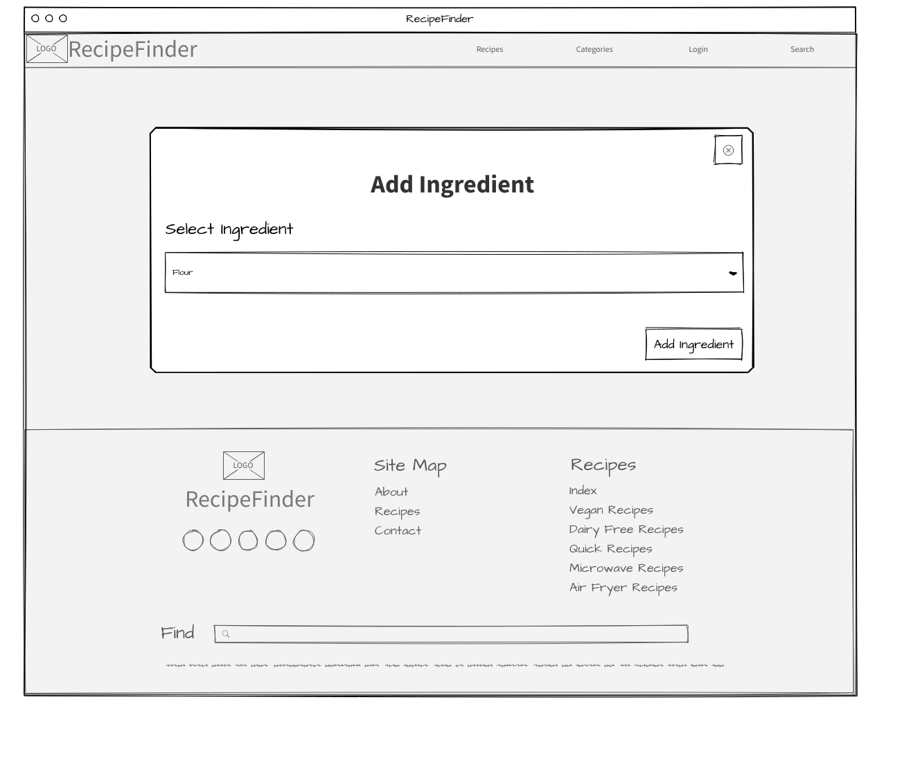
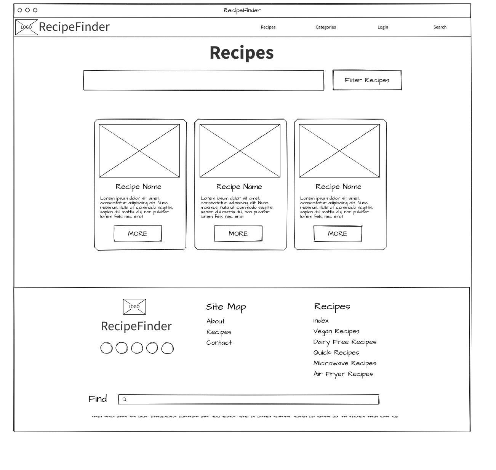

# Wireframes

## Add a cookbook

## Add ingredient to recipe

## Add recipe

## Add step to recipe

## Category List

## Category

## Contact

## Cookbook list

## Cookbook

## Edit cookbook

## Ingredient List

## Ingredient

## Landing Page

## Login

## Modal

## Modal Reset password

## New Ingredient

## Pantry

## Passwrod Reset

## Profile

## Recipe List

## Recipe

## Search

## Search Results

## Signup

## Update ingredient

## Update Recipe

## User profile

